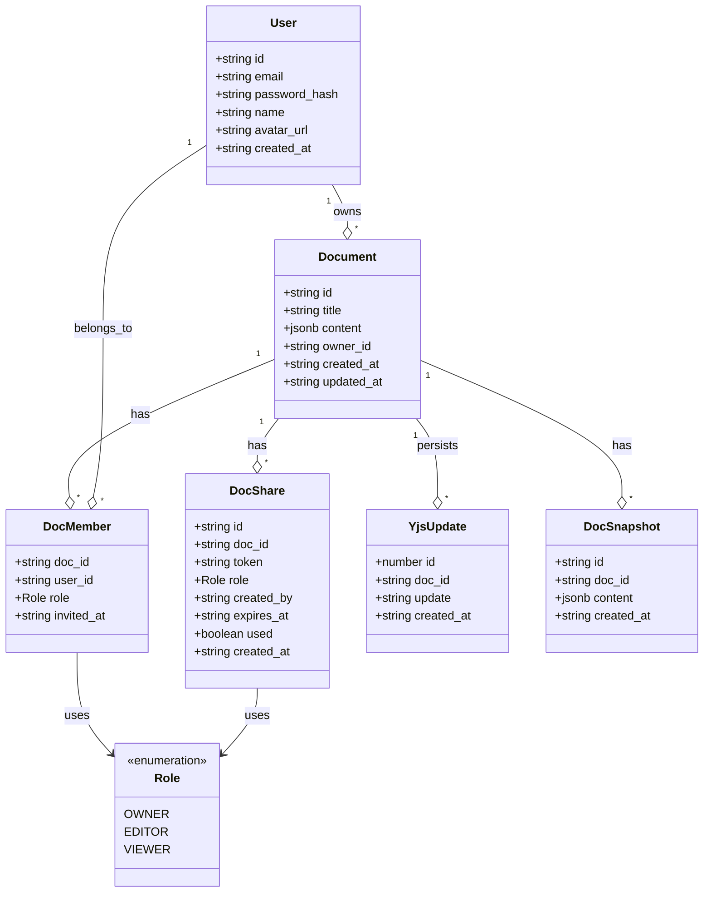
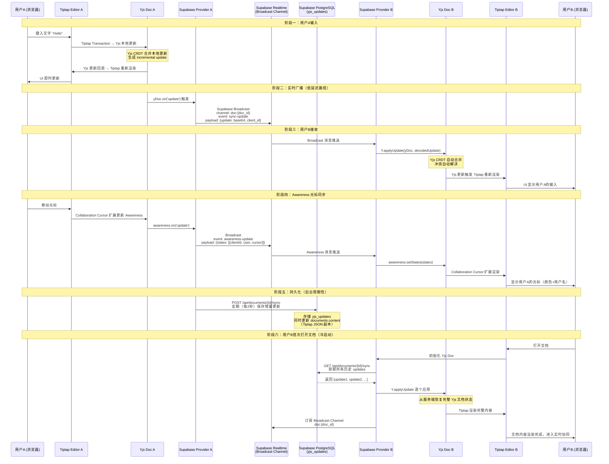
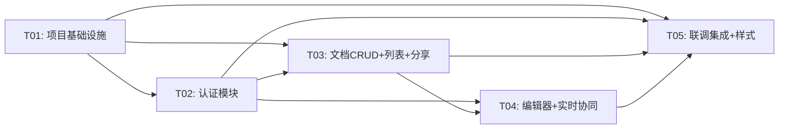

# ARCHITECTURE：多用户文档协作系统 `collab-docs`

**版本**：v1.0  
**架构师**：高见远（Gao）  
**日期**：2025-07-14  
**语言**：中文

---

## 1. 技术选型确认

### 1.1 核心框架

| 包名 | 版本 | 职责 |
|------|------|------|
| `next` | ^15.1.0 | React 全栈框架，App Router 模式 |
| `react` | ^19.0.0 | UI 库 |
| `react-dom` | ^19.0.0 | React DOM 渲染 |
| `typescript` | ^5.7.0 | 类型安全 |

### 1.2 UI 层

| 包名 | 版本 | 职责 |
|------|------|------|
| `antd` | ^5.22.0 | Ant Design 组件库 |
| `@ant-design/icons` | ^5.5.0 | Ant Design 图标 |
| `@ant-design/nextjs-registry` | ^1.0.0 | Ant Design Next.js App Router 集成 |

### 1.3 富文本 & 协同

| 包名 | 版本 | 职责 |
|------|------|------|
| `@tiptap/react` | ^2.10.0 | Tiptap React 绑定 |
| `@tiptap/starter-kit` | ^2.10.0 | Tiptap 基础扩展集（Heading, Bold, Italic, List, Blockquote, Code 等） |
| `@tiptap/extension-collaboration` | ^2.10.0 | Yjs CRDT 协同扩展 |
| `@tiptap/extension-collaboration-cursor` | ^2.10.0 | 多人光标显示扩展 |
| `yjs` | ^13.6.0 | CRDT 引擎 |
| `y-protocols` | ^1.0.6 | Yjs 同步协议（sync, awareness） |

### 1.4 后端 & 数据库

| 包名 | 版本 | 职责 |
|------|------|------|
| `@supabase/supabase-js` | ^2.45.0 | Supabase 客户端（Auth, DB, Realtime） |
| `bcryptjs` | ^2.4.3 | 密码哈希 |
| `jose` | ^5.9.0 | JWT 签发/验证（Edge Runtime 兼容） |
| `uuid` | ^10.0.0 | UUID 生成 |

### 1.5 工具链

| 包名 | 版本 | 职责 |
|------|------|------|
| `tailwindcss` | ^3.4.0 | 原子化 CSS |
| `postcss` | ^8.4.0 | CSS 处理 |
| `autoprefixer` | ^10.4.0 | CSS 前缀自动补全 |
| `eslint` | ^9.0.0 | 代码检查 |
| `@types/node` | ^22.0.0 | Node.js 类型 |
| `@types/react` | ^19.0.0 | React 类型 |
| `@types/bcryptjs` | ^2.4.0 | bcryptjs 类型 |

---

## 2. 项目目录结构

```
collab-docs/
├── docs/
│   ├── ARCHITECTURE.md            # 本文档
│   ├── PRD.md                     # 产品需求文档
│   ├── class-diagram.mermaid       # 类图
│   └── sequence-diagram.mermaid    # 时序图
├── public/
│   └── favicon.ico
├── src/
│   ├── app/                        # Next.js App Router
│   │   ├── layout.tsx              # 根布局（AntdRegistry + AuthProvider）
│   │   ├── page.tsx                # 首页（重定向到 /docs 或 /login）
│   │   ├── globals.css             # 全局样式（Tailwind + Ant Design 覆盖）
│   │   ├── login/
│   │   │   └── page.tsx            # 登录/注册页面
│   │   ├── docs/
│   │   │   ├── page.tsx            # 文档列表页
│   │   │   └── [id]/
│   │   │       └── page.tsx        # 文档编辑页（核心页面）
│   │   └── api/
│   │       ├── auth/
│   │       │   ├── register/
│   │       │   │   └── route.ts    # POST /api/auth/register
│   │       │   ├── login/
│   │       │   │   └── route.ts    # POST /api/auth/login
│   │       │   ├── logout/
│   │       │   │   └── route.ts    # POST /api/auth/logout
│   │       │   └── me/
│   │       │       └── route.ts    # GET /api/auth/me
│   │       ├── documents/
│   │       │   ├── route.ts        # POST 创建 / GET 列表
│   │       │   └── [id]/
│   │       │       ├── route.ts    # GET 详情 / DELETE 删除 / PATCH 更新标题
│   │       │       ├── members/
│   │       │       │   └── route.ts    # GET 成员列表 / POST 邀请成员 / PATCH 改权限 / DELETE 移除
│   │       │       ├── share/
│   │       │       │   └── route.ts    # POST 生成分享链接 / POST 通过链接加入
│   │       │       └── sync/
│   │       │           └── route.ts    # GET 获取 Yjs 更新 / POST 保存 Yjs 更新
│   │       └── share/
│   │           └── [token]/
│   │               └── route.ts    # GET 验证分享链接
│   ├── components/                 # React 组件
│   │   ├── auth/
│   │   │   ├── LoginForm.tsx       # 登录表单
│   │   │   ├── RegisterForm.tsx    # 注册表单
│   │   │   └── AuthGuard.tsx       # 路由鉴权守卫
│   │   ├── docs/
│   │   │   ├── DocCard.tsx         # 文档卡片
│   │   │   ├── DocList.tsx         # 文档列表（含 Tab 切换）
│   │   │   ├── DocToolbar.tsx      # Tiptap 工具栏
│   │   │   ├── CollaboratorAvatars.tsx  # 在线协作者头像列表
│   │   │   ├── ShareModal.tsx      # 分享弹窗
│   │   │   └── MemberList.tsx      # 成员管理列表
│   │   ├── editor/
│   │   │   └── TiptapEditor.tsx    # Tiptap 编辑器（含协同 & 光标扩展）
│   │   └── layout/
│   │       ├── Header.tsx          # 顶部导航栏
│   │       └── Sidebar.tsx         # 左侧侧边栏
│   ├── lib/                        # 工具库
│   │   ├── supabase/
│   │   │   ├── client.ts           # Supabase 浏览器客户端（Realtime + 普通查询）
│   │   │   └── server.ts           # Supabase 服务端客户端（API Routes 用）
│   │   ├── auth/
│   │   │   ├── jwt.ts              # JWT 签发/验证/刷新
│   │   │   ├── middleware.ts       # Next.js Middleware 鉴权逻辑
│   │   │   └── password.ts         # 密码哈希/验证
│   │   ├── collaboration/
│   │   │   ├── provider.ts         # Supabase Yjs Provider（Broadcast + 持久化）
│   │   │   └── awareness.ts        # Awareness 光标同步管理
│   │   └── utils.ts                # 通用工具函数
│   ├── hooks/                      # 自定义 Hooks
│   │   ├── useAuth.ts              # 鉴权状态 Hook
│   │   ├── useCollaboration.ts     # 协同编辑 Hook
│   │   ├── useDocuments.ts         # 文档 CRUD Hook
│   │   └── useShare.ts             # 分享逻辑 Hook
│   ├── types/                      # TypeScript 类型定义
│   │   ├── database.ts             # 数据库表类型（Supabase 生成）
│   │   ├── auth.ts                 # 鉴权相关类型
│   │   ├── document.ts             # 文档相关类型
│   │   └── collaboration.ts        # 协同相关类型
│   └── constants/                  # 常量
│       ├── roles.ts                # 权限角色常量
│       ├── editor.ts               # 编辑器默认配置
│       └── colors.ts               # 协作者颜色列表
├── supabase/
│   └── migrations/
│       └── 001_init.sql            # 数据库初始化迁移
├── middleware.ts                   # Next.js Middleware（鉴权拦截）
├── next.config.ts                  # Next.js 配置
├── tailwind.config.ts              # Tailwind CSS 配置
├── tsconfig.json                   # TypeScript 配置
├── postcss.config.mjs              # PostCSS 配置
├── package.json                    # 依赖声明
└── .env.local.example              # 环境变量示例
```

---

## 3. 数据库 Schema（完整 SQL）

```sql
-- ============================================================
-- collab-docs 数据库初始化迁移
-- 数据库：Supabase PostgreSQL
-- ============================================================

-- 1. 用户表
CREATE TABLE IF NOT EXISTS public.users (
  id          UUID PRIMARY KEY DEFAULT gen_random_uuid(),
  email       TEXT NOT NULL UNIQUE,
  password_hash TEXT NOT NULL,
  name        TEXT NOT NULL,
  avatar_url  TEXT,
  created_at  TIMESTAMPTZ NOT NULL DEFAULT now()
);

CREATE INDEX idx_users_email ON public.users(email);

-- 2. 文档表
CREATE TABLE IF NOT EXISTS public.documents (
  id          UUID PRIMARY KEY DEFAULT gen_random_uuid(),
  title       TEXT NOT NULL DEFAULT '未命名文档',
  content     JSONB NOT NULL DEFAULT '{}'::jsonb,
  owner_id    UUID NOT NULL REFERENCES public.users(id) ON DELETE CASCADE,
  created_at  TIMESTAMPTZ NOT NULL DEFAULT now(),
  updated_at  TIMESTAMPTZ NOT NULL DEFAULT now()
);

CREATE INDEX idx_documents_owner_id ON public.documents(owner_id);
CREATE INDEX idx_documents_updated_at ON public.documents(updated_at DESC);

-- 3. 文档成员表（权限控制）
CREATE TABLE IF NOT EXISTS public.doc_members (
  doc_id      UUID NOT NULL REFERENCES public.documents(id) ON DELETE CASCADE,
  user_id     UUID NOT NULL REFERENCES public.users(id) ON DELETE CASCADE,
  role        TEXT NOT NULL CHECK (role IN ('owner', 'editor', 'viewer')),
  invited_at  TIMESTAMPTZ NOT NULL DEFAULT now(),
  PRIMARY KEY (doc_id, user_id)
);

CREATE INDEX idx_doc_members_user_id ON public.doc_members(user_id);
CREATE INDEX idx_doc_members_doc_id ON public.doc_members(doc_id);

-- 4. Yjs 更新持久化表（二进制增量更新）
CREATE TABLE IF NOT EXISTS public.yjs_updates (
  id          BIGINT GENERATED ALWAYS AS IDENTITY PRIMARY KEY,
  doc_id      UUID NOT NULL REFERENCES public.documents(id) ON DELETE CASCADE,
  update      TEXT NOT NULL,  -- base64 编码的 Yjs 更新二进制
  created_at  TIMESTAMPTZ NOT NULL DEFAULT now()
);

CREATE INDEX idx_yjs_updates_doc_id ON public.yjs_updates(doc_id);

-- 5. 分享链接表
CREATE TABLE IF NOT EXISTS public.doc_shares (
  id          UUID PRIMARY KEY DEFAULT gen_random_uuid(),
  doc_id      UUID NOT NULL REFERENCES public.documents(id) ON DELETE CASCADE,
  token       TEXT NOT NULL UNIQUE,
  role        TEXT NOT NULL CHECK (role IN ('editor', 'viewer')) DEFAULT 'editor',
  created_by  UUID NOT NULL REFERENCES public.users(id),
  expires_at  TIMESTAMPTZ,          -- NULL 表示永不过期
  used        BOOLEAN NOT NULL DEFAULT false,
  created_at  TIMESTAMPTZ NOT NULL DEFAULT now()
);

CREATE INDEX idx_doc_shares_token ON public.doc_shares(token);
CREATE INDEX idx_doc_shares_doc_id ON public.doc_shares(doc_id);

-- 6. 文档快照表（P1 历史版本，MVP 阶段预留）
CREATE TABLE IF NOT EXISTS public.doc_snapshots (
  id          UUID PRIMARY KEY DEFAULT gen_random_uuid(),
  doc_id      UUID NOT NULL REFERENCES public.documents(id) ON DELETE CASCADE,
  content     JSONB NOT NULL,
  created_at  TIMESTAMPTZ NOT NULL DEFAULT now()
);

CREATE INDEX idx_doc_snapshots_doc_id ON public.doc_snapshots(doc_id);

-- ============================================================
-- RLS（Row Level Security）策略
-- ============================================================

ALTER TABLE public.users ENABLE ROW LEVEL SECURITY;
ALTER TABLE public.documents ENABLE ROW LEVEL SECURITY;
ALTER TABLE public.doc_members ENABLE ROW LEVEL SECURITY;
ALTER TABLE public.yjs_updates ENABLE ROW LEVEL SECURITY;
ALTER TABLE public.doc_shares ENABLE ROW LEVEL SECURITY;
ALTER TABLE public.doc_snapshots ENABLE ROW LEVEL SECURITY;

-- users：用户只能读自己的记录
CREATE POLICY "users_read_own" ON public.users
  FOR SELECT USING (auth.jwt() ->> 'sub' = id::text);

CREATE POLICY "users_update_own" ON public.users
  FOR UPDATE USING (auth.jwt() ->> 'sub' = id::text);

-- documents：owner 或 doc_members 中有记录的用户可读
CREATE POLICY "documents_select" ON public.documents
  FOR SELECT USING (
    owner_id::text = auth.jwt() ->> 'sub'
    OR EXISTS (
      SELECT 1 FROM public.doc_members
      WHERE doc_id = documents.id
      AND user_id::text = auth.jwt() ->> 'sub'
    )
  );

-- documents：仅 owner 可写
CREATE POLICY "documents_insert" ON public.documents
  FOR INSERT WITH CHECK (owner_id::text = auth.jwt() ->> 'sub');

CREATE POLICY "documents_update" ON public.documents
  FOR UPDATE USING (owner_id::text = auth.jwt() ->> 'sub');

CREATE POLICY "documents_delete" ON public.documents
  FOR DELETE USING (owner_id::text = auth.jwt() ->> 'sub');

-- doc_members：有权限的用户可查看
CREATE POLICY "doc_members_select" ON public.doc_members
  FOR SELECT USING (
    doc_id IN (
      SELECT id FROM public.documents
      WHERE owner_id::text = auth.jwt() ->> 'sub'
      OR EXISTS (
        SELECT 1 FROM public.doc_members dm
        WHERE dm.doc_id = documents.id
        AND dm.user_id::text = auth.jwt() ->> 'sub'
      )
    )
  );

-- doc_members：仅 owner 可管理成员
CREATE POLICY "doc_members_insert" ON public.doc_members
  FOR INSERT WITH CHECK (
    doc_id IN (SELECT id FROM public.documents WHERE owner_id::text = auth.jwt() ->> 'sub')
  );

CREATE POLICY "doc_members_delete" ON public.doc_members
  FOR DELETE USING (
    doc_id IN (SELECT id FROM public.documents WHERE owner_id::text = auth.jwt() ->> 'sub')
  );

-- yjs_updates：有文档访问权限的用户可读写
CREATE POLICY "yjs_updates_select" ON public.yjs_updates
  FOR SELECT USING (
    doc_id IN (
      SELECT id FROM public.documents
      WHERE owner_id::text = auth.jwt() ->> 'sub'
      OR EXISTS (
        SELECT 1 FROM public.doc_members
        WHERE doc_id = documents.id AND user_id::text = auth.jwt() ->> 'sub'
      )
    )
  );

CREATE POLICY "yjs_updates_insert" ON public.yjs_updates
  FOR INSERT WITH CHECK (
    doc_id IN (
      SELECT id FROM public.documents
      WHERE owner_id::text = auth.jwt() ->> 'sub'
      OR EXISTS (
        SELECT 1 FROM public.doc_members
        WHERE doc_id = documents.id
        AND user_id::text = auth.jwt() ->> 'sub'
        AND role IN ('owner', 'editor')
      )
    )
  );

-- doc_shares：owner 可读写，受邀者可通过 token 验证
CREATE POLICY "doc_shares_select" ON public.doc_shares
  FOR SELECT USING (
    doc_id IN (SELECT id FROM public.documents WHERE owner_id::text = auth.jwt() ->> 'sub')
  );

CREATE POLICY "doc_shares_insert" ON public.doc_shares
  FOR INSERT WITH CHECK (created_by::text = auth.jwt() ->> 'sub');

-- doc_snapshots：有文档访问权限的用户可读
CREATE POLICY "doc_snapshots_select" ON public.doc_snapshots
  FOR SELECT USING (
    doc_id IN (
      SELECT id FROM public.documents
      WHERE owner_id::text = auth.jwt() ->> 'sub'
      OR EXISTS (
        SELECT 1 FROM public.doc_members
        WHERE doc_id = documents.id AND user_id::text = auth.jwt() ->> 'sub'
      )
    )
  );

-- ============================================================
-- 触发器：自动更新 updated_at
-- ============================================================

CREATE OR REPLACE FUNCTION update_updated_at()
RETURNS TRIGGER AS $$
BEGIN
  NEW.updated_at = now();
  RETURN NEW;
END;
$$ LANGUAGE plpgsql;

CREATE TRIGGER documents_updated_at
  BEFORE UPDATE ON public.documents
  FOR EACH ROW EXECUTE FUNCTION update_updated_at();
```

---

## 4. 数据结构和接口

### 4.1 类图



### 4.2 TypeScript 类型定义

```typescript
// src/types/auth.ts

export interface AuthUser {
  id: string;
  email: string;
  name: string;
  avatar_url: string | null;
}

export interface LoginRequest {
  email: string;
  password: string;
}

export interface RegisterRequest {
  email: string;
  password: string;
  name: string;
}

export interface AuthResponse {
  code: number;
  data: AuthUser | null;
  message: string;
}

// src/types/document.ts

import { Role } from './collaboration';

export interface Document {
  id: string;
  title: string;
  content: Record<string, unknown>; // Tiptap JSON
  owner_id: string;
  created_at: string;
  updated_at: string;
}

export interface DocMember {
  doc_id: string;
  user_id: string;
  role: Role;
  invited_at: string;
  // join 后补充
  user?: {
    id: string;
    name: string;
    email: string;
    avatar_url: string | null;
  };
}

export interface DocShare {
  id: string;
  doc_id: string;
  token: string;
  role: Role;
  created_by: string;
  expires_at: string | null;
  used: boolean;
  created_at: string;
}

export interface CreateDocumentRequest {
  title?: string;
}

export interface UpdateDocumentRequest {
  title?: string;
  content?: Record<string, unknown>;
}

export interface InviteMemberRequest {
  email: string;
  role: Role.EDITOR | Role.VIEWER;
}

export interface UpdateMemberRoleRequest {
  user_id: string;
  role: Role;
}

export interface ShareRequest {
  role: Role.EDITOR | Role.VIEWER;
  expires_in_hours?: number; // null = 永不过期
}

export interface JoinByShareRequest {
  token: string;
}

// src/types/collaboration.ts

export enum Role {
  OWNER = 'owner',
  EDITOR = 'editor',
  VIEWER = 'viewer',
}

export interface CollabUser {
  id: string;
  name: string;
  color: string;
  cursor?: {
    index: number;
    length: number;
  };
}

export interface AwarenessState {
  user: CollabUser;
  clientId: number;
}

export interface YjsSyncMessage {
  type: 'sync' | 'update';
  doc_id: string;
  update: string; // base64 编码
  client_id: number;
}

export interface AwarenessMessage {
  type: 'awareness';
  doc_id: string;
  states: AwarenessState[];
}

// src/types/database.ts

export interface Database {
  public: {
    Tables: {
      users: {
        Row: {
          id: string;
          email: string;
          password_hash: string;
          name: string;
          avatar_url: string | null;
          created_at: string;
        };
        Insert: {
          id?: string;
          email: string;
          password_hash: string;
          name: string;
          avatar_url?: string | null;
          created_at?: string;
        };
        Update: {
          id?: string;
          email?: string;
          password_hash?: string;
          name?: string;
          avatar_url?: string | null;
        };
      };
      documents: {
        Row: {
          id: string;
          title: string;
          content: Record<string, unknown>;
          owner_id: string;
          created_at: string;
          updated_at: string;
        };
        Insert: {
          id?: string;
          title?: string;
          content?: Record<string, unknown>;
          owner_id: string;
          created_at?: string;
          updated_at?: string;
        };
        Update: {
          title?: string;
          content?: Record<string, unknown>;
          updated_at?: string;
        };
      };
      doc_members: {
        Row: {
          doc_id: string;
          user_id: string;
          role: string;
          invited_at: string;
        };
        Insert: {
          doc_id: string;
          user_id: string;
          role: string;
          invited_at?: string;
        };
        Update: {
          role?: string;
        };
      };
      doc_shares: {
        Row: {
          id: string;
          doc_id: string;
          token: string;
          role: string;
          created_by: string;
          expires_at: string | null;
          used: boolean;
          created_at: string;
        };
        Insert: {
          id?: string;
          doc_id: string;
          token: string;
          role: string;
          created_by: string;
          expires_at?: string | null;
          used?: boolean;
          created_at?: string;
        };
        Update: {
          used?: boolean;
        };
      };
      yjs_updates: {
        Row: {
          id: number;
          doc_id: string;
          update: string;
          created_at: string;
        };
        Insert: {
          doc_id: string;
          update: string;
          created_at?: string;
        };
        Update: {};
      };
      doc_snapshots: {
        Row: {
          id: string;
          doc_id: string;
          content: Record<string, unknown>;
          created_at: string;
        };
        Insert: {
          id?: string;
          doc_id: string;
          content: Record<string, unknown>;
          created_at?: string;
        };
        Update: {};
      };
    };
  };
}
```

---

## 5. API 接口设计

> 所有接口统一响应格式：`{ code: number, data: T | null, message: string }`  
> 鉴权：JWT 通过 httpOnly Cookie 传递，API Routes 从 Cookie 中读取验证

### 5.1 用户认证

#### POST `/api/auth/register`

注册新用户。

**Request Body:**
```json
{
  "email": "user@example.com",
  "password": "password123",
  "name": "张三"
}
```

**Response (201):**
```json
{
  "code": 201,
  "data": {
    "id": "uuid",
    "email": "user@example.com",
    "name": "张三",
    "avatar_url": null
  },
  "message": "注册成功"
}
```

**Error (409):**
```json
{
  "code": 409,
  "data": null,
  "message": "该邮箱已注册"
}
```

---

#### POST `/api/auth/login`

用户登录，签发 JWT 写入 httpOnly Cookie。

**Request Body:**
```json
{
  "email": "user@example.com",
  "password": "password123"
}
```

**Response (200):**
```json
{
  "code": 200,
  "data": {
    "id": "uuid",
    "email": "user@example.com",
    "name": "张三",
    "avatar_url": null
  },
  "message": "登录成功"
}
```

**Error (401):**
```json
{
  "code": 401,
  "data": null,
  "message": "邮箱或密码错误"
}
```

> Cookie 设置：`Set-Cookie: token=xxx; HttpOnly; Secure; SameSite=Lax; Path=/; Max-Age=86400`

---

#### POST `/api/auth/logout`

退出登录，清除 Cookie。

**Response (200):**
```json
{
  "code": 200,
  "data": null,
  "message": "已退出登录"
}
```

---

#### GET `/api/auth/me`

获取当前登录用户信息。

**Response (200):**
```json
{
  "code": 200,
  "data": {
    "id": "uuid",
    "email": "user@example.com",
    "name": "张三",
    "avatar_url": null
  },
  "message": "ok"
}
```

**Error (401):** 未登录或 Token 过期

---

### 5.2 文档管理

#### POST `/api/documents`

创建新文档，当前用户自动成为 owner。

**Request Body:**
```json
{
  "title": "新建文档"
}
```

**Response (201):**
```json
{
  "code": 201,
  "data": {
    "id": "uuid",
    "title": "新建文档",
    "content": {},
    "owner_id": "uuid",
    "created_at": "2025-07-14T10:00:00Z",
    "updated_at": "2025-07-14T10:00:00Z"
  },
  "message": "创建成功"
}
```

---

#### GET `/api/documents?type=owned|shared`

获取文档列表。

**Query Parameters:**
| 参数 | 说明 | 默认值 |
|------|------|--------|
| `type` | `owned` = 我的文档，`shared` = 共享给我 | `owned` |

**Response (200):**
```json
{
  "code": 200,
  "data": [
    {
      "id": "uuid",
      "title": "文档标题",
      "updated_at": "2025-07-14T10:00:00Z",
      "owner_id": "uuid",
      "member_count": 3,
      "role": "owner"
    }
  ],
  "message": "ok"
}
```

---

#### GET `/api/documents/[id]`

获取文档详情（含 content）。需为 owner 或 doc_member。

**Response (200):**
```json
{
  "code": 200,
  "data": {
    "id": "uuid",
    "title": "文档标题",
    "content": { "type": "doc", "content": [...] },
    "owner_id": "uuid",
    "created_at": "2025-07-14T10:00:00Z",
    "updated_at": "2025-07-14T10:00:00Z",
    "my_role": "editor"
  },
  "message": "ok"
}
```

**Error (403):** 无权限
**Error (404):** 文档不存在

---

#### PATCH `/api/documents/[id]`

更新文档（标题或内容）。owner/editor 可操作。

**Request Body:**
```json
{
  "title": "新标题"
}
```

**Response (200):**
```json
{
  "code": 200,
  "data": { "id": "uuid", "title": "新标题" },
  "message": "更新成功"
}
```

---

#### DELETE `/api/documents/[id]`

删除文档（仅 owner 可操作）。级联删除所有关联数据。

**Response (200):**
```json
{
  "code": 200,
  "data": null,
  "message": "删除成功"
}
```

---

### 5.3 成员管理

#### GET `/api/documents/[id]/members`

获取文档成员列表。需有文档访问权限。

**Response (200):**
```json
{
  "code": 200,
  "data": [
    {
      "user_id": "uuid",
      "name": "张三",
      "email": "zhang@example.com",
      "role": "owner",
      "invited_at": "2025-07-14T10:00:00Z"
    }
  ],
  "message": "ok"
}
```

---

#### POST `/api/documents/[id]/members`

通过邮箱邀请成员。仅 owner 可操作。

**Request Body:**
```json
{
  "email": "new@example.com",
  "role": "editor"
}
```

**Response (201):**
```json
{
  "code": 201,
  "data": { "doc_id": "uuid", "user_id": "uuid", "role": "editor" },
  "message": "邀请成功"
}
```

**Error (404):** 用户不存在
**Error (409):** 用户已是成员

---

#### PATCH `/api/documents/[id]/members`

修改成员权限。仅 owner 可操作。

**Request Body:**
```json
{
  "user_id": "uuid",
  "role": "viewer"
}
```

**Response (200):**
```json
{
  "code": 200,
  "data": null,
  "message": "权限已更新"
}
```

---

#### DELETE `/api/documents/[id]/members?user_id=xxx`

移除成员。仅 owner 可操作。

**Response (200):**
```json
{
  "code": 200,
  "data": null,
  "message": "成员已移除"
}
```

---

### 5.4 分享链接

#### POST `/api/documents/[id]/share`

生成分享链接。仅 owner 可操作。

**Request Body:**
```json
{
  "role": "editor",
  "expires_in_hours": 72
}
```

**Response (201):**
```json
{
  "code": 201,
  "data": {
    "token": "abc123xyz",
    "share_url": "/share/abc123xyz",
    "role": "editor",
    "expires_at": "2025-07-17T10:00:00Z"
  },
  "message": "分享链接已生成"
}
```

---

#### POST `/api/documents/[id]/share` (action: join)

通过分享链接加入文档。

**Request Body:**
```json
{
  "action": "join",
  "token": "abc123xyz"
}
```

**Response (200):**
```json
{
  "code": 200,
  "data": { "doc_id": "uuid", "role": "editor" },
  "message": "已加入文档"
}
```

---

#### GET `/api/share/[token]`

验证分享链接，返回文档基本信息（不需要登录也可以查看，但加入需要登录）。

**Response (200):**
```json
{
  "code": 200,
  "data": {
    "doc_id": "uuid",
    "title": "文档标题",
    "role": "editor",
    "expires_at": "2025-07-17T10:00:00Z",
    "is_expired": false,
    "is_used": false
  },
  "message": "ok"
}
```

---

### 5.5 Yjs 同步

#### GET `/api/documents/[id]/sync`

获取文档的所有 Yjs 增量更新。编辑器初始化时调用，用于从服务端恢复 Yjs 文档状态。

**Response (200):**
```json
{
  "code": 200,
  "data": {
    "updates": ["base64-update-1", "base64-update-2", ...]
  },
  "message": "ok"
}
```

---

#### POST `/api/documents/[id]/sync`

保存 Yjs 增量更新。客户端定期（每 2 秒）或在关键操作后调用。

**Request Body:**
```json
{
  "update": "base64-encoded-yjs-update",
  "client_id": 12345
}
```

**Response (200):**
```json
{
  "code": 200,
  "data": null,
  "message": "同步成功"
}
```

---

## 6. 协同架构时序图

### 6.1 用户输入 → 实时协同 → 渲染 完整流程



### 6.2 Supabase Yjs Provider 核心逻辑说明

```
SupabaseYjsProvider {
  // 连接管理
  - connect(): 创建 Supabase Broadcast Channel（doc:{doc_id}）
  - disconnect(): 取消订阅，清理资源

  // 实时同步
  - onBroadcastMessage(msg):
      if msg.type === 'sync-update':
        Y.applyUpdate(yDoc, decode(msg.update))
      if msg.type === 'awareness-update':
        awareness.applyAwarenessUpdate(decode(msg.states))

  - onLocalUpdate(update):
      // 广播给其他用户
      channel.send({type: 'sync-update', update: encode(update)})
      // 缓存待持久化
      pendingUpdates.push(update)

  // 持久化（每2秒批量）
  - flushToServer():
      POST /api/documents/{id}/sync
      { updates: pendingUpdates.map(encode) }
      pendingUpdates = []

  // 冷启动
  - loadFromServer():
      GET /api/documents/{id}/sync
      updates.forEach(u => Y.applyUpdate(yDoc, decode(u)))
}
```

---

## 7. 有序任务列表

### T01: 项目基础设施

**文件列表：**
- `package.json`
- `next.config.ts`
- `tsconfig.json`
- `tailwind.config.ts`
- `postcss.config.mjs`
- `.env.local.example`
- `src/app/layout.tsx`
- `src/app/globals.css`
- `src/app/page.tsx`
- `middleware.ts`
- `supabase/migrations/001_init.sql`

**说明：** 初始化 Next.js 15 项目，安装所有依赖，配置 Tailwind CSS / Ant Design / TypeScript，创建根布局和首页，配置 Next.js Middleware 骨架，执行数据库初始化迁移。

**依赖：** 无

**优先级：** P0

---

### T02: 认证模块

**文件列表：**
- `src/lib/supabase/client.ts`
- `src/lib/supabase/server.ts`
- `src/lib/auth/jwt.ts`
- `src/lib/auth/password.ts`
- `src/lib/auth/middleware.ts`
- `src/app/api/auth/register/route.ts`
- `src/app/api/auth/login/route.ts`
- `src/app/api/auth/logout/route.ts`
- `src/app/api/auth/me/route.ts`
- `src/types/auth.ts`
- `src/types/database.ts`
- `src/app/login/page.tsx`
- `src/components/auth/LoginForm.tsx`
- `src/components/auth/RegisterForm.tsx`
- `src/components/auth/AuthGuard.tsx`
- `src/hooks/useAuth.ts`

**说明：** 实现完整的用户注册/登录/登出流程，JWT 签发与 httpOnly Cookie 管理，Next.js Middleware 鉴权拦截，登录/注册 UI 页面，AuthGuard 路由守卫组件。

**依赖：** T01

**优先级：** P0

---

### T03: 文档 CRUD + 列表页 + 分享

**文件列表：**
- `src/app/api/documents/route.ts`
- `src/app/api/documents/[id]/route.ts`
- `src/app/api/documents/[id]/members/route.ts`
- `src/app/api/documents/[id]/share/route.ts`
- `src/app/api/share/[token]/route.ts`
- `src/types/document.ts`
- `src/types/collaboration.ts`
- `src/constants/roles.ts`
- `src/constants/colors.ts`
- `src/constants/editor.ts`
- `src/app/docs/page.tsx`
- `src/components/docs/DocCard.tsx`
- `src/components/docs/DocList.tsx`
- `src/components/docs/ShareModal.tsx`
- `src/components/docs/MemberList.tsx`
- `src/components/layout/Header.tsx`
- `src/components/layout/Sidebar.tsx`
- `src/hooks/useDocuments.ts`
- `src/hooks/useShare.ts`
- `src/lib/utils.ts`

**说明：** 实现文档创建/删除/列表 API，文档列表页面（我的文档/共享给我 Tab），文档成员管理 API（邀请/改权限/移除），分享链接生成与验证 API，对应的 UI 组件，三级权限控制逻辑。

**依赖：** T01, T02

**优先级：** P0

---

### T04: 富文本编辑器 + 多人实时协同

**文件列表：**
- `src/app/docs/[id]/page.tsx`
- `src/components/editor/TiptapEditor.tsx`
- `src/components/docs/DocToolbar.tsx`
- `src/components/docs/CollaboratorAvatars.tsx`
- `src/lib/collaboration/provider.ts`
- `src/lib/collaboration/awareness.ts`
- `src/app/api/documents/[id]/sync/route.ts`
- `src/hooks/useCollaboration.ts`

**说明：** 集成 Tiptap 编辑器，配置基础格式扩展（H1-H3, Bold, Italic, List, Blockquote, Code），实现 Yjs + Supabase Broadcast 实时协同（SupabaseYjsProvider），实现 Collaboration Cursor 多人光标显示，Yjs 更新持久化 API（GET/POST sync），Awareness 光标同步，协作者头像列表。

**依赖：** T01, T02, T03

**优先级：** P0

---

### T05: 联调集成 + 样式打磨

**文件列表：**
- `src/app/layout.tsx`（修改：完善 AuthProvider 集成）
- `src/app/page.tsx`（修改：完善路由跳转）
- `src/app/globals.css`（修改：完善协同光标样式等）
- `src/components/auth/AuthGuard.tsx`（修改：完善边界情况）
- `src/app/docs/[id]/page.tsx`（修改：完善编辑器加载状态和错误处理）
- `src/components/editor/TiptapEditor.tsx`（修改：完善断线重连、权限控制）
- `src/lib/collaboration/provider.ts`（修改：完善重连逻辑、冲突恢复）

**说明：** 全链路联调，完善编辑器加载/断线/重连体验，viewer 权限下编辑器只读模式，分享链接加入后的跳转流程，UI 样式细节打磨，边界情况处理（网络断开、Token 过期、并发冲突等）。

**依赖：** T01, T02, T03, T04

**优先级：** P0

---

### 任务依赖图



---

## 8. 共享约定

### 8.1 API 响应格式

所有 API Routes 统一返回：
```typescript
interface ApiResponse<T> {
  code: number;      // HTTP 状态码
  data: T | null;   // 业务数据
  message: string;  // 可读消息
}
```

### 8.2 鉴权约定

- JWT 存储在 **httpOnly Cookie**（名为 `token`），由 `/api/auth/login` 签发
- JWT 有效期 **24 小时**，使用 `jose` 库签发和验证（兼容 Edge Runtime）
- Next.js Middleware 对 `/docs/**` 路径进行鉴权拦截，未登录重定向到 `/login`
- API Routes 从 Cookie 中读取 JWT 并验证，将用户信息附加到请求上下文

### 8.3 JWT Payload 结构

```json
{
  "sub": "user-uuid",
  "email": "user@example.com",
  "name": "张三",
  "iat": 1720944000,
  "exp": 1721030400
}
```

### 8.4 协同频道命名

- 文档操作同步：`doc:{doc_id}` — Broadcast Channel
- Awareness 光标同步：同上，在同一个 Broadcast Channel 内用不同 event 区分
  - `sync-update`：Yjs 增量更新
  - `awareness-update`：光标/选区状态

### 8.5 Yjs 更新持久化策略

- 客户端每 **2 秒** 批量将待持久化的 Yjs 更新发送到 `/api/documents/{id}/sync`
- yjs_updates 表存储 base64 编码的增量更新
- documents.content 字段同时维护 Tiptap JSON 副本（用于直接读取和列表预览）
- 冷启动时从 `/api/documents/{id}/sync` 获取所有增量更新重建 Yjs 文档

### 8.6 协作者颜色分配

预定义 10 种颜色，按用户加入顺序分配：
```typescript
const COLLABORATOR_COLORS = [
  '#7C3AED', // 紫色
  '#2563EB', // 蓝色
  '#059669', // 绿色
  '#D97706', // 橙色
  '#DC2626', // 红色
  '#0891B2', // 青色
  '#4F46E5', // 靛色
  '#BE185D', // 粉色
  '#65A30D', // 黄绿
  '#9333EA', // 深紫
];
```

### 8.7 权限控制规则

| 操作 | owner | editor | viewer |
|------|-------|--------|--------|
| 编辑文档内容 | ✅ | ✅ | ❌ |
| 修改文档标题 | ✅ | ✅ | ❌ |
| 删除文档 | ✅ | ❌ | ❌ |
| 邀请成员 | ✅ | ❌ | ❌ |
| 修改成员权限 | ✅ | ❌ | ❌ |
| 移除成员 | ✅ | ❌ | ❌ |
| 生成分享链接 | ✅ | ❌ | ❌ |
| 查看文档 | ✅ | ✅ | ✅ |

### 8.8 编辑器默认内容

新文档的 Tiptap JSON 默认结构：
```json
{
  "type": "doc",
  "content": [
    {
      "type": "heading",
      "attrs": { "level": 1 },
      "content": [{ "type": "text", "text": "未命名文档" }]
    }
  ]
}
```

### 8.9 日期时间格式

- 数据库存储：UTC，`TIMESTAMPTZ`
- API 响应：ISO 8601 UTC 字符串（`2025-07-14T10:00:00Z`）
- 前端显示：使用 `dayjs` 按用户本地时区格式化

---

## 9. 待明确事项

| # | 问题 | 影响范围 | 建议 |
|---|------|----------|------|
| 1 | **Yjs 更新合并策略**：yjs_updates 表会随时间积累大量增量记录，是否需要定期合并（mergeUpdates）为单一快照？性能影响？ | 持久化性能 | MVP 阶段暂不处理，文档加载时逐个 apply；P1 阶段增加后台合并任务 |
| 2 | **Supabase 免费版 Realtime 连接限制（200 并发）**：是否需要设计连接复用或离线缓存降级策略？ | 实时协同稳定性 | MVP 阶段 200 并发足够，后续可引入连接池或降级为轮询 |
| 3 | **断线重连后的状态同步**：断线期间其他用户的操作如何补齐？依赖 Yjs CRDT 本身的合并能力是否足够？ | 协同可靠性 | Yjs CRDT 可自动合并，但需要确保断线期间的增量更新从服务端补拉 |
| 4 | **文档内容双写一致性**：documents.content（Tiptap JSON）和 yjs_updates（增量）可能不一致，如何保证？ | 数据一致性 | 以 yjs_updates 为 source of truth，documents.content 为只读快照，定期从 Yjs 状态导出覆盖 |
| 5 | **分享链接安全性**：一次性链接 vs 可重复使用？是否需要 CAPTCHA 防止暴力枚举？ | 分享安全 | MVP 使用 UUID v4 token（128bit 熵，不可猜测），链接可重复使用直到过期 |
| 6 | **Avatar 头像方案**：使用 Gravatar / DiceBear 等第三方头像服务，还是上传自定义头像？ | 用户资料 | MVP 使用 DiceBear API（`https://api.dicebear.com/7.x/initials/svg?seed=用户名`），无需上传 |
| 7 | **Tiptap JSON 与 HTML 互转**：列表页是否需要预览文档内容摘要？如需要，Tiptap JSON → 纯文本的提取逻辑？ | 文档列表 | MVP 列表页仅显示标题和更新时间，不做内容预览 |

---

*架构文档 v1.0 — 如有变更请同步更新此文档*
