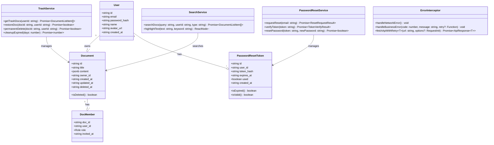
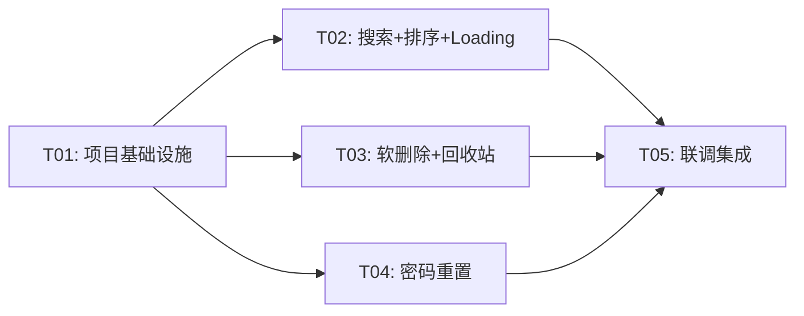

# P1 增量架构设计：CollabDocs 体验增强

**版本**：v2.0（增量）  
**架构师**：高见远（Gao）  
**日期**：2025-07-14  
**语言**：中文

---

## 1. 实现方案

### 1.1 核心技术挑战

| # | 挑战 | 对应需求 | 解决方案 |
|---|------|----------|----------|
| 1 | 文档搜索需同时支持前端即时过滤和后端模糊查询 | R01 | 双模式：输入 < 300ms 防抖后端查询，未防抖时前端内存过滤已加载列表 |
| 2 | 软删除改造需同时修改 DELETE API、列表查询、新增回收站 | R05/R06 | documents 表新增 `deleted_at` 字段，所有现有查询加 `deleted_at IS NULL` 条件，DELETE 改为 UPDATE |
| 3 | 密码重置无 Supabase Auth，需自建完整流程 | R07/R12 | 新增 `password_reset_tokens` 表，MVP 方案：前端验证邮箱后直接显示重置表单（无需邮件），token 1 小时有效 |
| 4 | 回收站自动清理需要定时任务 | R10 | Vercel Cron + Next.js API Route，每天执行一次清理 |
| 5 | 统一错误拦截需兼容现有 `fetchApi` 模式 | R04 | 扩展 `fetchApi`，新增 `handleApiError` 函数分派网络错误与业务错误 |

### 1.2 框架与库选型

| 包名 | 版本 | 用途 | 选型理由 |
|------|------|------|----------|
| `nodemailer` | ^6.9.0 | 密码重置邮件发送 | P1 阶段可扩展为邮件方式；MVP 先不启用，预留接口 |
| `crypto` | Node 内置 | 生成密码重置 token | 无需额外依赖，`crypto.randomBytes(32)` 生成安全 token |
| `dayjs` | ^1.11.0 | 日期格式化 | 轻量级日期库，Ant Design 已内置依赖 |

> **说明**：P1 增量功能不需要引入新的重大框架依赖，所有实现基于现有 Next.js + Ant Design + Supabase 技术栈。

### 1.3 架构模式

沿用现有架构：Next.js App Router + API Routes + Supabase Client/Server 分层。  
新增模块遵循相同模式：API Route → Supabase 查询 → 前端 Hook → Ant Design 组件。

---

## 2. 数据库变更

### 2.1 documents 表 — 新增字段

```sql
-- 软删除字段
ALTER TABLE public.documents ADD COLUMN deleted_at TIMESTAMPTZ DEFAULT NULL;

-- 索引：回收站查询优化
CREATE INDEX idx_documents_deleted_at ON public.documents(deleted_at) WHERE deleted_at IS NOT NULL;

-- 索引：列表查询优化（未删除 + 按更新时间排序）
CREATE INDEX idx_documents_active_updated ON public.documents(owner_id, updated_at DESC) WHERE deleted_at IS NULL;
```

### 2.2 password_reset_tokens 表 — 新增

```sql
-- 密码重置 token 表
CREATE TABLE IF NOT EXISTS public.password_reset_tokens (
  id          UUID PRIMARY KEY DEFAULT gen_random_uuid(),
  user_id     UUID NOT NULL REFERENCES public.users(id) ON DELETE CASCADE,
  token_hash  TEXT NOT NULL UNIQUE,  -- SHA-256 哈希后的 token，不存原文
  expires_at  TIMESTAMPTZ NOT NULL,   -- 过期时间
  used        BOOLEAN NOT NULL DEFAULT false,
  created_at  TIMESTAMPTZ NOT NULL DEFAULT now()
);

CREATE INDEX idx_password_reset_tokens_token_hash ON public.password_reset_tokens(token_hash);
CREATE INDEX idx_password_reset_tokens_user_id ON public.password_reset_tokens(user_id);

ALTER TABLE public.password_reset_tokens ENABLE ROW LEVEL SECURITY;

-- 仅服务端操作，不开放客户端直接访问
CREATE POLICY "password_reset_tokens_no_access" ON public.password_reset_tokens
  FOR ALL USING (false) WITH CHECK (false);
```

### 2.3 现有查询影响

所有现有查询 `documents` 表的地方，都需要添加 `deleted_at IS NULL` 条件：

| 查询位置 | 修改 |
|----------|------|
| `GET /api/documents?type=owned` | `.is('deleted_at', null)` |
| `GET /api/documents?type=shared` | 子查询中加 `.is('deleted_at', null)` |
| `GET /api/documents/[id]` | 详情查询加 `.is('deleted_at', null)` |
| `PATCH /api/documents/[id]` | 权限检查时过滤已删除文档 |
| `POST /api/documents/[id]/sync` | 同步时过滤已删除文档 |

---

## 3. 文件列表

### 3.1 新增文件

| 相对路径 | 用途 |
|----------|------|
| `supabase/migrations/002_p1_soft_delete_and_reset.sql` | 数据库迁移：documents 加 deleted_at + password_reset_tokens 表 |
| `src/app/trash/page.tsx` | 回收站列表页 |
| `src/app/forgot-password/page.tsx` | 忘记密码页（输入邮箱 + 验证 + 重置） |
| `src/app/reset-password/page.tsx` | 重置密码页（token 验证后设置新密码） |
| `src/app/api/auth/forgot-password/route.ts` | POST 忘记密码 — 验证邮箱、生成 token |
| `src/app/api/auth/reset-password/route.ts` | POST 重置密码 — 验证 token、更新密码 |
| `src/app/api/trash/route.ts` | GET 回收站文档列表 |
| `src/app/api/trash/[id]/route.ts` | PATCH 恢复文档 / DELETE 永久删除文档 |
| `src/app/api/cron/cleanup-trash/route.ts` | Vercel Cron 定时清理回收站（30 天） |
| `src/hooks/useTrash.ts` | 回收站数据 Hook |
| `src/hooks/usePasswordReset.ts` | 密码重置流程 Hook |
| `src/components/trash/TrashList.tsx` | 回收站文档列表组件 |
| `src/components/trash/TrashCard.tsx` | 回收站文档卡片组件 |
| `src/components/auth/ForgotPasswordForm.tsx` | 忘记密码表单组件 |
| `src/components/auth/ResetPasswordForm.tsx` | 重置密码表单组件 |
| `src/components/common/ErrorRetry.tsx` | 行内错误提示 + 重试按钮组件 |
| `src/components/common/LoadingSkeleton.tsx` | 列表/详情页 Loading Skeleton 组件 |

### 3.2 修改文件

| 相对路径 | 修改内容 |
|----------|----------|
| `src/lib/utils.ts` | 扩展 fetchApi 增加错误拦截；新增 searchHighlight 高亮函数 |
| `src/hooks/useDocuments.ts` | 增加 search/sort 参数；增加 localFilter 本地搜索；排序持久化 |
| `src/app/api/documents/route.ts` | 增加 search/sort 参数查询；所有查询加 deleted_at IS NULL |
| `src/app/api/documents/[id]/route.ts` | DELETE 改为软删除；查询加 deleted_at 过滤 |
| `src/app/docs/page.tsx` | 集成搜索框、排序切换、Loading Skeleton |
| `src/components/docs/DocList.tsx` | 搜索高亮、删除改为移入回收站提示 |
| `src/components/docs/DocCard.tsx` | 标题搜索高亮渲染 |
| `src/components/layout/Sidebar.tsx` | 新增「回收站」菜单项 |
| `src/components/layout/Header.tsx` | 无修改（搜索框在列表页不在 Header） |
| `src/app/login/page.tsx` | 新增「忘记密码？」入口链接 |
| `src/components/auth/LoginForm.tsx` | 底部增加「忘记密码？」链接 |
| `src/types/document.ts` | 新增 DocumentListItem 的 deleted_at 字段；搜索/排序类型 |
| `src/types/auth.ts` | 新增密码重置相关类型 |
| `src/types/database.ts` | documents 表增加 deleted_at；新增 password_reset_tokens 表类型 |
| `middleware.ts` | 新增 /forgot-password、/reset-password、/trash 路由放行/鉴权规则 |
| `next.config.ts` | 新增 Vercel Cron 配置 |
| `package.json` | 无新依赖（使用 Node 内置 crypto） |

---

## 4. 数据结构与接口

### 4.1 类图



### 4.2 TypeScript 类型定义

```typescript
// ==================== src/types/document.ts 增量 ====================

/** 文档列表项（P1 增量：新增 deleted_at） */
export interface DocumentListItem {
  id: string;
  title: string;
  updated_at: string;
  owner_id: string;
  member_count: number;
  role: string;
  deleted_at?: string | null; // P1 新增：软删除时间
}

/** 文档（P1 增量：新增 deleted_at） */
export interface Document {
  id: string;
  title: string;
  content: Record<string, unknown>;
  owner_id: string;
  created_at: string;
  updated_at: string;
  deleted_at: string | null; // P1 新增
}

/** 排序方式 */
export type SortOrder = 'updated_desc' | 'updated_asc';

/** 文档列表查询参数（P1 扩展） */
export interface DocumentListParams {
  type: 'owned' | 'shared';
  search?: string;     // R01: 搜索关键词
  sort?: SortOrder;    // R02: 排序方式
}

// ==================== src/types/auth.ts 增量 ====================

/** 忘记密码请求 */
export interface ForgotPasswordRequest {
  email: string;
}

/** 忘记密码响应 */
export interface ForgotPasswordResponse {
  token: string;       // MVP：直接返回 token（不发送邮件）
  message: string;
}

/** 重置密码请求 */
export interface ResetPasswordRequest {
  token: string;
  new_password: string;
}

/** 重置密码响应 */
export interface ResetPasswordResponse {
  success: boolean;
  message: string;
}

/** Token 验证结果 */
export interface TokenVerifyResult {
  valid: boolean;
  email?: string;
  message: string;
}

// ==================== src/types/database.ts 增量 ====================

// documents 表 Row 增加 deleted_at 字段
// 新增 password_reset_tokens 表类型

export interface PasswordResetTokenRow {
  id: string;
  user_id: string;
  token_hash: string;
  expires_at: string;
  used: boolean;
  created_at: string;
}
```

### 4.3 API 接口设计（P1 增量）

#### 4.3.1 文档列表查询扩展

**GET `/api/documents?type=owned|shared&search=关键词&sort=updated_desc|updated_asc`**

新增 Query Parameters：

| 参数 | 说明 | 默认值 |
|------|------|--------|
| `search` | 按标题模糊搜索（Supabase `ilike`） | 无 |
| `sort` | `updated_desc` 最新优先 / `updated_asc` 最早优先 | `updated_desc` |

**搜索逻辑**：
- 有 `search` 参数时：Supabase 查询加 `.ilike('title', `%${search}%`)` 
- 无 `search` 参数时：不添加搜索条件
- 所有查询均加 `.is('deleted_at', null)` 过滤软删除文档

**排序逻辑**：
- `updated_desc`：`.order('updated_at', { ascending: false })`（默认）
- `updated_asc`：`.order('updated_at', { ascending: true })`

---

#### 4.3.2 文档删除改造（软删除）

**DELETE `/api/documents/[id]`** — 改为软删除

行为变更：不再物理删除，而是 `UPDATE documents SET deleted_at = now() WHERE id = ?`

**Response (200)：**
```json
{
  "code": 200,
  "data": null,
  "message": "文档已移入回收站"
}
```

---

#### 4.3.3 回收站列表

**GET `/api/trash`** — 获取回收站文档列表

需登录，仅返回当前用户拥有的已删除文档。

**Response (200)：**
```json
{
  "code": 200,
  "data": [
    {
      "id": "uuid",
      "title": "已删除的文档",
      "updated_at": "2025-07-14T10:00:00Z",
      "deleted_at": "2025-07-15T08:00:00Z",
      "owner_id": "uuid",
      "remaining_days": 25
    }
  ],
  "message": "ok"
}
```

---

#### 4.3.4 恢复文档

**PATCH `/api/trash/[id]`** — 恢复文档

将 `deleted_at` 设为 `NULL`，文档重新出现在正常列表中。

**Response (200)：**
```json
{
  "code": 200,
  "data": null,
  "message": "文档已恢复"
}
```

---

#### 4.3.5 永久删除

**DELETE `/api/trash/[id]`** — 物理删除文档

从数据库中彻底删除文档及其所有关联数据（级联删除）。

**Response (200)：**
```json
{
  "code": 200,
  "data": null,
  "message": "文档已永久删除"
}
```

---

#### 4.3.6 忘记密码

**POST `/api/auth/forgot-password`** — 请求密码重置

**Request Body：**
```json
{
  "email": "user@example.com"
}
```

**MVP Response (200)：**
```json
{
  "code": 200,
  "data": {
    "token": "raw-token-string",
    "message": "邮箱验证成功，请设置新密码"
  },
  "message": "ok"
}
```

> MVP 方案说明：验证邮箱已注册后，直接返回 token。前端拿到 token 后跳转到 `/reset-password?token=xxx` 页面。  
> 未来扩展：改为发送邮件，token 不在响应中返回，改为邮件中的链接。

**Error (404)：**
```json
{
  "code": 404,
  "data": null,
  "message": "该邮箱未注册"
}
```

---

#### 4.3.7 重置密码

**POST `/api/auth/reset-password`** — 执行密码重置

**Request Body：**
```json
{
  "token": "raw-token-string",
  "new_password": "newPassword123"
}
```

**Response (200)：**
```json
{
  "code": 200,
  "data": null,
  "message": "密码重置成功，请使用新密码登录"
}
```

**Error (400)：** token 无效/过期/已使用
**Error (422)：** 密码不符合要求（长度 < 6）

---

#### 4.3.8 回收站自动清理（Cron）

**GET `/api/cron/cleanup-trash`** — Vercel Cron 定时调用

使用 `CRON_SECRET` 环境变量验证调用来源。

逻辑：删除 `deleted_at < now() - interval '30 days'` 的文档（物理删除）。

**Response (200)：**
```json
{
  "code": 200,
  "data": { "deleted_count": 5 },
  "message": "清理完成"
}
```

---

## 5. 程序调用流程

### 5.1 文档搜索 + 排序流程

```
用户输入搜索关键词
    ↓
防抖 300ms
    ↓
调用 useDocuments.refresh({ search, sort })
    ↓
fetchApi(`/api/documents?type=owned&search=${keyword}&sort=${sort}`)
    ↓
API Route: GET /api/documents
    ↓
Supabase 查询:
  .from('documents')
  .select(...)
  .eq('owner_id', userId)
  .is('deleted_at', null)              ← 软删除过滤
  .ilike('title', `%${search}%`)       ← 模糊搜索
  .order('updated_at', { ascending })   ← 排序
    ↓
返回文档列表
    ↓
前端渲染 DocList → DocCard 中 highlightText 高亮匹配关键词
```

### 5.2 软删除 + 回收站恢复流程

```
用户点击「删除」
    ↓
弹出确认：「文档将移入回收站，30天后自动删除」
    ↓
确认 → DELETE /api/documents/[id]
    ↓
API: UPDATE documents SET deleted_at = now() WHERE id = ?
    ↓
返回成功 → 列表页移除该文档
    ↓
（用户进入回收站）
    ↓
GET /api/trash → 查询 deleted_at IS NOT NULL 的文档
    ↓
显示回收站列表
    ↓
用户点击「恢复」→ PATCH /api/trash/[id]
    ↓
API: UPDATE documents SET deleted_at = NULL WHERE id = ?
    ↓
返回成功 → 回收站移除该文档，文档重新出现在列表页

用户点击「永久删除」→ DELETE /api/trash/[id]
    ↓
API: 物理删除（CASCADE）
    ↓
二次确认后执行
```

### 5.3 密码重置流程（MVP）

```
用户点击「忘记密码？」
    ↓
跳转 /forgot-password
    ↓
输入邮箱 → POST /api/auth/forgot-password
    ↓
API:
  1. 查询 users 表验证邮箱是否存在
  2. 生成 crypto.randomBytes(32).toString('hex') → rawToken
  3. SHA-256(rawToken) → token_hash
  4. INSERT password_reset_tokens (user_id, token_hash, expires_at=now()+1h)
  5. 返回 { token: rawToken }  ← MVP 直接返回
    ↓
前端跳转 /reset-password?token=rawToken
    ↓
用户输入新密码 + 确认密码 → POST /api/auth/reset-password
    ↓
API:
  1. SHA-256(token) → token_hash
  2. 查询 password_reset_tokens WHERE token_hash AND used=false AND expires_at > now()
  3. 验证通过 → bcryptjs.hash(newPassword) → UPDATE users SET password_hash
  4. 标记 token 为 used=true
    ↓
返回成功 → 跳转 /login 提示「密码已重置，请重新登录」
```

### 5.4 统一错误拦截流程

```
fetchApi 调用
    ↓
try { fetch } catch { 网络错误 }
    ↓
网络错误 → message.error('网络连接失败，请检查网络后重试')
    ↓
HTTP 响应成功 → 解析 JSON
    ↓
code === 200 → 正常返回 data
    ↓
code !== 200 → 业务错误
    ↓
code === 401 → 跳转 /login（Token 过期）
    ↓
code === 403 → 行内提示 '无权限操作' + ErrorRetry 组件
    ↓
code === 404 → 行内提示 '资源不存在' + ErrorRetry 组件
    ↓
code === 429 → message.warning('操作过于频繁，请稍后重试')
    ↓
其他 → message.error(res.message) + 可选 ErrorRetry
```

### 5.5 Loading Skeleton 流程

```
页面组件挂载 → loading=true
    ↓
渲染 <LoadingSkeleton type="list" /> 或 <LoadingSkeleton type="detail" />
    ↓
数据加载完成 → loading=false
    ↓
渲染实际内容
```

### 5.6 Vercel Cron 自动清理流程

```
Vercel Cron 每天执行 GET /api/cron/cleanup-trash
    ↓
验证 CRON_SECRET header
    ↓
查询: SELECT id FROM documents WHERE deleted_at < now() - interval '30 days'
    ↓
逐个物理删除（级联删除关联数据）
    ↓
返回 { deleted_count: N }
```

---

## 6. 任务列表

### T01: 项目基础设施（数据库迁移 + 类型 + 工具函数）

**描述**：执行数据库变更（documents 加 deleted_at、新增 password_reset_tokens 表），更新 TypeScript 类型定义，扩展 fetchApi 错误拦截，新增高亮工具函数和 Loading Skeleton / ErrorRetry 通用组件。

**涉及文件**：
- `supabase/migrations/002_p1_soft_delete_and_reset.sql`（新增）
- `src/types/document.ts`（修改：增加 SortOrder、DocumentListParams、deleted_at）
- `src/types/auth.ts`（修改：增加密码重置相关类型）
- `src/types/database.ts`（修改：documents 增加 deleted_at、新增 password_reset_tokens 表类型）
- `src/lib/utils.ts`（修改：扩展 fetchApi 错误拦截、新增 highlightText 函数）
- `src/components/common/LoadingSkeleton.tsx`（新增）
- `src/components/common/ErrorRetry.tsx`（新增）
- `next.config.ts`（修改：新增 Vercel Cron 配置）

**依赖**：无  
**优先级**：P0

---

### T02: 搜索 + 排序 + Loading 改造

**描述**：扩展文档列表 API 支持 search 和 sort 参数，改造 useDocuments Hook 支持搜索/排序/本地过滤，改造文档列表页集成搜索框和排序切换，DocCard 标题高亮，所有列表/详情页替换 Spin 为 Skeleton，排序持久化到 localStorage。

**涉及文件**：
- `src/app/api/documents/route.ts`（修改：增加 search/sort 参数，加 deleted_at 过滤）
- `src/hooks/useDocuments.ts`（修改：增加 search/sort 参数，排序持久化）
- `src/app/docs/page.tsx`（修改：集成搜索框、排序切换、Loading Skeleton）
- `src/components/docs/DocList.tsx`（修改：传递搜索关键词、删除提示改为移入回收站）
- `src/components/docs/DocCard.tsx`（修改：标题搜索高亮）
- `src/app/docs/[id]/page.tsx`（修改：Loading Skeleton）

**依赖**：T01  
**优先级**：P0

---

### T03: 软删除 + 回收站

**描述**：改造 DELETE API 为软删除，修改所有现有查询加 deleted_at IS NULL 条件，新增回收站列表/恢复/永久删除 API，新增回收站页面和组件，Vercel Cron 定时清理 30 天过期文档，更新 Sidebar 增加「回收站」入口。

**涉及文件**：
- `src/app/api/documents/[id]/route.ts`（修改：DELETE 改为软删除，查询加 deleted_at 过滤）
- `src/app/api/trash/route.ts`（新增：回收站列表 API）
- `src/app/api/trash/[id]/route.ts`（新增：恢复/永久删除 API）
- `src/app/api/cron/cleanup-trash/route.ts`（新增：Cron 清理 API）
- `src/app/trash/page.tsx`（新增：回收站页面）
- `src/components/trash/TrashList.tsx`（新增）
- `src/components/trash/TrashCard.tsx`（新增）
- `src/hooks/useTrash.ts`（新增）
- `src/components/layout/Sidebar.tsx`（修改：增加回收站菜单项）
- `middleware.ts`（修改：/trash 路由鉴权，/api/cron 路由 CRON_SECRET 验证）

**依赖**：T01  
**优先级**：P0

---

### T04: 密码重置流程

**描述**：实现完整的密码重置 MVP 流程——忘记密码页输入邮箱验证后直接跳转重置密码页（不发送邮件），新增忘记密码和重置密码 API，新增对应页面和组件，登录页增加「忘记密码？」入口。

**涉及文件**：
- `src/app/api/auth/forgot-password/route.ts`（新增：验证邮箱+生成 token）
- `src/app/api/auth/reset-password/route.ts`（新增：验证 token+更新密码）
- `src/app/forgot-password/page.tsx`（新增：忘记密码页面）
- `src/app/reset-password/page.tsx`（新增：重置密码页面）
- `src/components/auth/ForgotPasswordForm.tsx`（新增）
- `src/components/auth/ResetPasswordForm.tsx`（新增）
- `src/hooks/usePasswordReset.ts`（新增）
- `src/app/login/page.tsx`（修改：增加忘记密码链接）
- `src/components/auth/LoginForm.tsx`（修改：增加忘记密码链接）
- `middleware.ts`（修改：/forgot-password 和 /reset-password 路由放行）

**依赖**：T01  
**优先级**：P0

---

### T05: 联调集成 + 体验打磨

**描述**：全链路联调测试，验证搜索/排序/软删除/回收站/密码重置功能完整流程，统一错误处理体验，Loading Skeleton 一致性检查，边界情况处理（空搜索结果、token 过期、并发删除等），Sidebar 和 Header 交互优化。

**涉及文件**：
- `src/app/docs/page.tsx`（修改：搜索空结果状态、排序切换过渡）
- `src/app/trash/page.tsx`（修改：空回收站状态、操作反馈）
- `src/app/forgot-password/page.tsx`（修改：错误状态、流程优化）
- `src/app/reset-password/page.tsx`（修改：token 过期处理、成功跳转）
- `src/hooks/useDocuments.ts`（修改：搜索防抖优化、错误处理）
- `src/hooks/useTrash.ts`（修改：操作反馈、错误处理）
- `src/hooks/usePasswordReset.ts`（修改：流程异常处理）

**依赖**：T02, T03, T04  
**优先级**：P1

---

### 任务依赖图



---

## 7. 依赖包列表

```
- nodemailer@^6.9.0: 密码重置邮件发送（MVP 不启用，预留扩展）
- dayjs@^1.11.0: 日期格式化（Ant Design 已有依赖，确认安装）
```

> P1 增量功能几乎不需要新增依赖：crypto 为 Node 内置，highlightText 为纯前端实现，Vercel Cron 为平台能力。

---

## 8. 共享知识

### 8.1 软删除约定

- `documents.deleted_at = NULL` 表示正常文档
- `documents.deleted_at IS NOT NULL` 表示已删除（在回收站中）
- **所有现有查询必须加 `deleted_at IS NULL` 条件**，除非是回收站相关查询
- 软删除后 30 天自动物理删除（Vercel Cron 每天清理）
- 永久删除使用物理 DELETE（级联删除关联数据）

### 8.2 搜索与排序约定

- 搜索使用 Supabase `ilike` 模糊匹配，大小写不敏感
- 前端防抖 300ms 后发起搜索请求
- 排序方式持久化到 `localStorage`，key: `collab-docs-sort-order`
- 默认排序：`updated_desc`（最新更新优先）

### 8.3 错误处理约定

- **网络错误**：`fetchApi` catch 中统一 `message.error('网络连接失败，请检查网络后重试')`
- **401 错误**：前端跳转 `/login`
- **403/404 错误**：行内 `<ErrorRetry>` 组件显示错误信息 + 重试按钮
- **429 错误**：`message.warning('操作过于频繁，请稍后重试')`
- **其他业务错误**：`message.error(res.message)` + 可选重试

### 8.4 Loading Skeleton 约定

- 列表页使用 `<LoadingSkeleton type="list" />`：3 行卡片骨架
- 详情页使用 `<LoadingSkeleton type="detail" />`：标题 + 内容区域骨架
- 编辑器页使用 `<LoadingSkeleton type="editor" />`：工具栏 + 编辑区骨架
- 加载完成前显示 Skeleton，加载后直接替换为实际内容（无 Spin）

### 8.5 密码重置 Token 约定

- Token 使用 `crypto.randomBytes(32).toString('hex')` 生成（64 字符 hex）
- 数据库存储 SHA-256(token) 的哈希值，不存原文
- Token 有效期 1 小时
- Token 使用后标记 `used = true`，不可复用
- MVP：token 在 forgot-password API 响应中直接返回（不发送邮件）
- 未来扩展：token 通过邮件链接传递，API 响应不再返回 token

### 8.6 回收站约定

- 删除文档时弹窗提示：「文档将移入回收站，30 天后自动删除」
- 回收站显示：文档标题、删除时间、剩余天数
- 恢复操作：`PATCH /api/trash/[id]`，将 `deleted_at` 设为 NULL
- 永久删除：`DELETE /api/trash/[id]`，需二次确认
- 回收站仅显示当前用户 owner 的已删除文档

### 8.7 Vercel Cron 约定

- Cron 路径：`/api/cron/cleanup-trash`
- 调度频率：每天凌晨 2:00 UTC
- 认证：请求头 `Authorization: Bearer ${CRON_SECRET}`
- 清理逻辑：`deleted_at < now() - interval '30 days'`

---

## 9. 待明确事项

| # | 问题 | 影响范围 | 建议方案 |
|---|------|----------|----------|
| 1 | **密码重置 MVP 的安全性**：直接在 API 响应中返回 token，任何人知道邮箱即可重置密码 | 安全性 | MVP 阶段可接受（产品未上线），上线前必须改为邮件验证方式 |
| 2 | **搜索是否需要支持内容搜索**：当前仅搜索标题，是否需要搜索文档内容？ | 搜索范围 | MVP 仅搜索标题，内容搜索需要全文索引（Supabase 免费版支持 pg_trgm），P2 考虑 |
| 3 | **回收站文档的协作者访问**：文档被软删除后，共享成员是否还能通过直接链接访问？ | 权限边界 | 软删除后所有人均不可访问（查询已加 deleted_at IS NULL），恢复后恢复访问权限 |
| 4 | **回收站清理的批量性能**：如果一次性清理大量文档，是否需要分批处理？ | Cron 稳定性 | MVP 每次清理上限 100 条，超出则分批，避免 Supabase 请求超时 |
| 5 | **前端搜索双模式**：是否需要同时实现「前端即时过滤 + 后端查询」双模式，还是统一用后端查询？ | 搜索体验 | MVP 统一使用后端查询（300ms 防抖），体验足够流畅，前端过滤暂不实现 |
| 6 | **nodemailer SMTP 选择**：如果未来启用邮件，使用哪个 SMTP 服务？ | 邮件发送 | 建议使用 Resend（Vercel 推荐的邮件服务，免费额度 100 封/天），或 Gmail SMTP |

---

*架构设计 v2.0 — P1 增量 — 如有变更请同步更新此文档*
